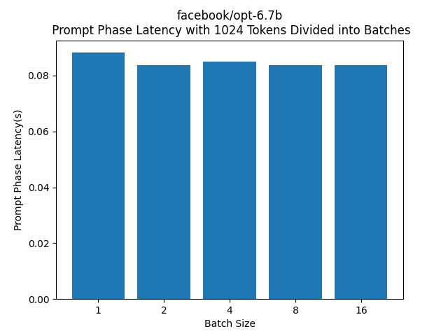
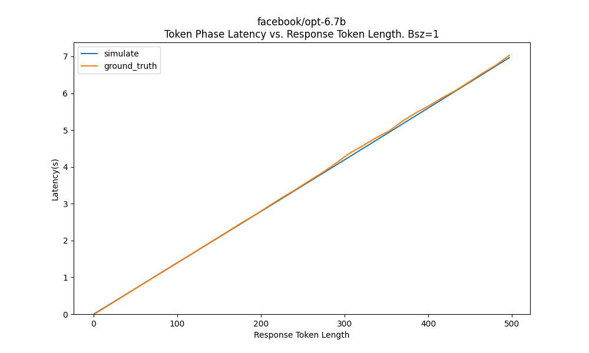
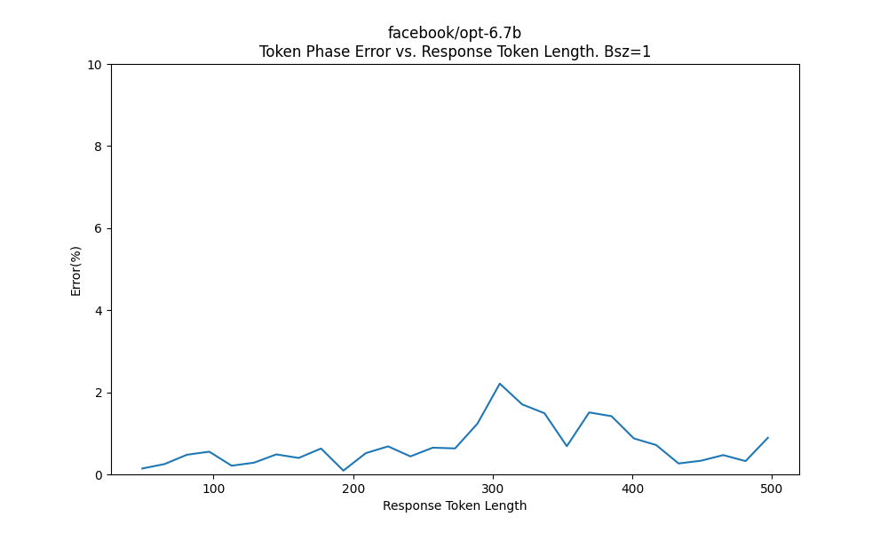
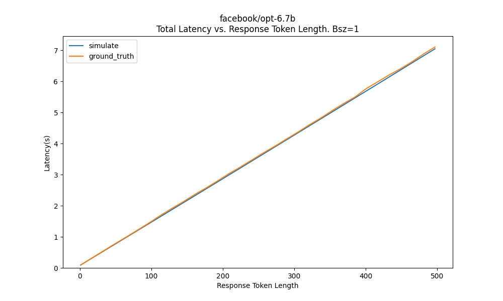
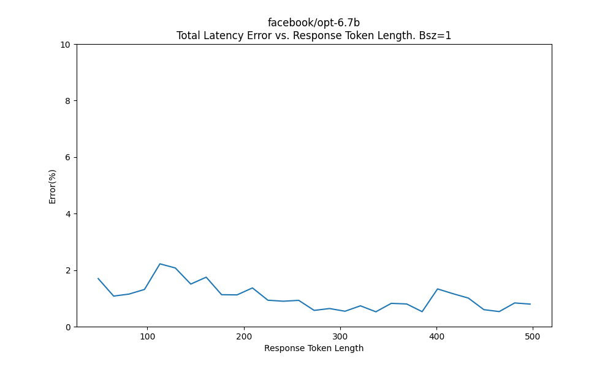

# LLM-simulator
A simulator that simulates LLM inference latency

## Prompt Phase
Prompt Phase refers to the phase of converting incoming prompt into kv-cache, which is also referred to as "pre-fill phase", this phase is computational intensive, and process all tokens in parallel.

According to [Splitwise paper](https://arxiv.org/abs/2311.18677), prompt phase latency is related to the total prompt tokens processed, and is not related to how many batches these tokens are divided.

To illustrate this, we did the following experiment:
With the same total number of 1024 tokens, we divide these tokens into batches with different batch size(1,2,4,8,16), for example, for bsz=1 batch, each prompt has 1024 tokens, for bsz=2 batch, each prompt has 512 tokens, for bsz=4 batch, each prompt has 256 tokens, ...

Then we collect the prompt phase latency of these different batches, as shown in the figure below:


The prompt phase latency is basically the same, proving that prompt phase latency is only related to the total number of batches, and has no relationship with the batch size.

Our next step is to get the relationship between prompt phase latency and total token number. We choose the largest model(facebook/opt-30b) that can fit into our GPU(A100-80G), and perform prompt phase generation with different prompt token number, below is the result:

As you can see, up to token length 2048, the prompt phase latency still shows a linear relationship with prompt token number, this illustrates that although prompt phase is compute intensive, our GPU compute resources has not saturated when prompt token length reaches 2048.

Therefore we derive our prompt phase latency formula as:
$
L_p=\frac{N_p}{k}=\frac{bsz\times n_p}{k}
$

Where:
 * $L_p$ is the prompt phase latency
 * $N_p$ is the prompt phase token number, with a batch size of `bsz` and prompt length of `np`,  `Np = bsz * np`
 * $n_p$ is the prompt token length
 * $k$ denotes the `Prompt Token Process Speed(Token/s)`(PTPS), in our simulator, we will collect it using linear regression.

To collect PTPS for a model under specific GPU, run:
```
python profile_prompt.py --model-name=facebook/opt-6.7b
```
It will write the ptps to `./data/ptps.json`, it will obtain the ptps of the current model on the current GPU.
It might take a few minutes to complete.

## Token Phase
Token phase refers to the phase where LLM process tokens in an auto-regressive way, token-by-token, this phase is also referred to as "decoding phase".

Token phase is a memory-intensive phase, here by memory-intensive, we mean:
* The latency is bottlenecked by GPU HBM memory bandwidth.
* It will write GB(s) of kv-cache to GPU, thus stressing the GPU memory capacity.

According to this [article](https://www.databricks.com/blog/llm-inference-performance-engineering-best-practices), for each token generation, LLM would read model weights and current KVC from HBM once. Token phase latency is dominated by HBM memory access instead of computation, so if we ignore the computation latency, the latency for generating the i th token L_i is given by:
$
L_i \approx L_{MW} + L_{KVC_i}
$
Where:
* $Li$ is the token phase latency for generating the i'th token.
* $L_{MW}$ is the memory access latency for reading model weights from HBM.
* $L_{KVC_i}$ is the memory access latency for reading current KVC from HBM.

Knowing the size of the model weights, size of KVC and memory bandwidth, the equation becomes:
$L_{MW} = \frac{S_{MW}}{BW}$, $L_{KVC_i} = \frac{S_{KVC_i}}{BW}$
$S_{KVC_i} = (N_p + i \times bsz)\times s_{KVC}$

Therefore, the latency for generating the i'th token in token phase becomes:
$L_i \approx \frac{S_{MW} + (N_p+i\times bsz)\times s_{KVC}}{BW}$
The token phase latency for a prompt with `np=Np/bsz` prompt length and `nt` response length and batch size `bsz` can be given as:
$L_t = \sum^{n_t}_{i=1} \frac{S_{MW} + (n_p+i) \times bsz\times s_{KVC}}{BW}$
It can be then simplified to:
$L_t = bsz\times \alpha n_t^2 + (bsz\times \beta + C) n_t$
Where:
* $\alpha = \frac{s_{KVC}}{2BW}$
* $\beta = \frac{(n_p + \frac{1}{2}) s_{KVC}}{BW}$
* $C = \frac{S_{MW}}{BW}$

In practice, $C >> \beta$, especially when prompt length $np$ is small, therefore increasing the batch size wouldn't bring a linear scaling in token phase latency, the throughput of token phase would increase, bringing batching benefits.

We examine the above equation with following experiment:
$n_p=1024$, $n_t=1-512$, $bsz=1$, below is the simulated token phase latency and ground truth token phase latency:
 

As demonstrated, the error stays below 5%.
(The curve doesn't show a parabola trend because $\alpha$ is very small compared with $\beta + C$)

## Over All Latency
Based on the above conlcusion, assume we perform LLM inference with the following parameter:
prompt length=$n_p$, response length=$n_t$, batch size= $bsz$, the overall latency can be calculated as the sum of prompt phase and token phase:
$L = L_p + L_t$
$L = \frac{bsz\times n_p}{k} + bsz\times \alpha n_t^2 + (bsz\times beta+C)n_t$
We examine it with $n_p=1024$, $n_t=1-512$, $bsz=1$



